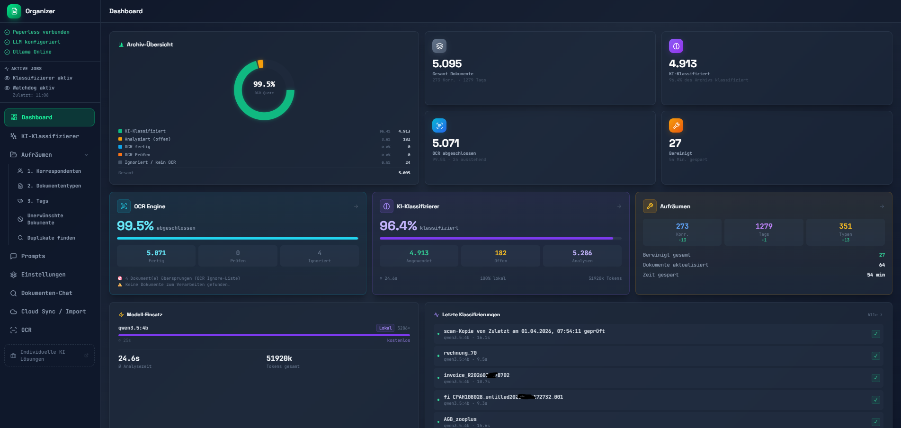
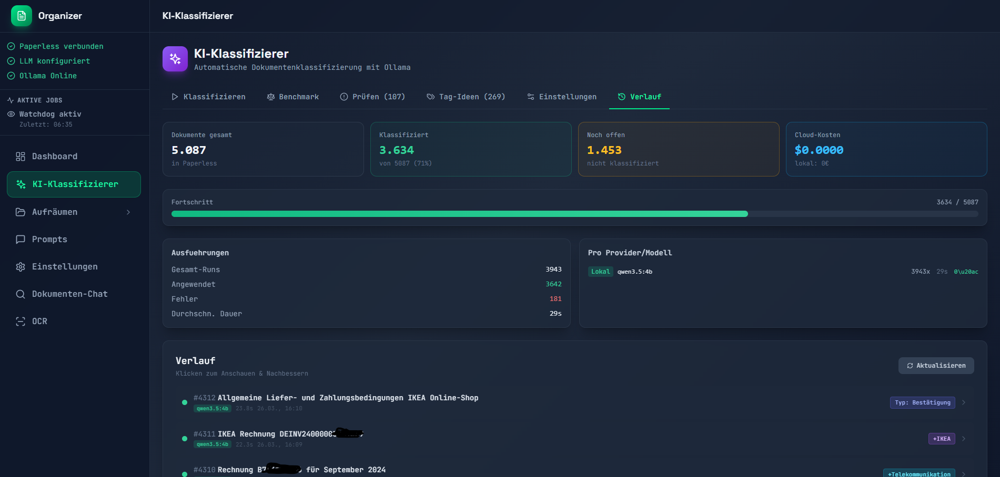
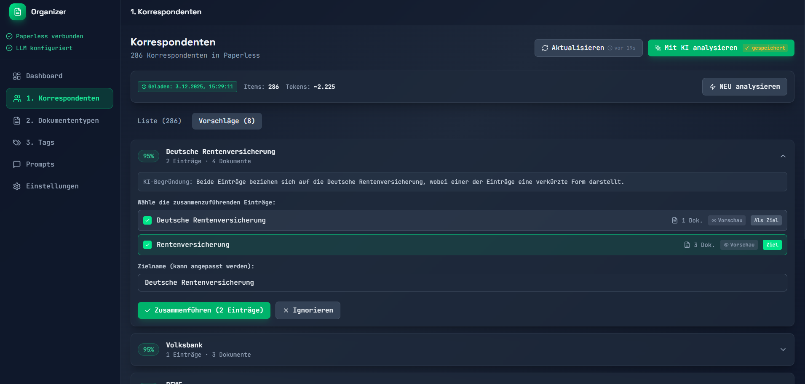
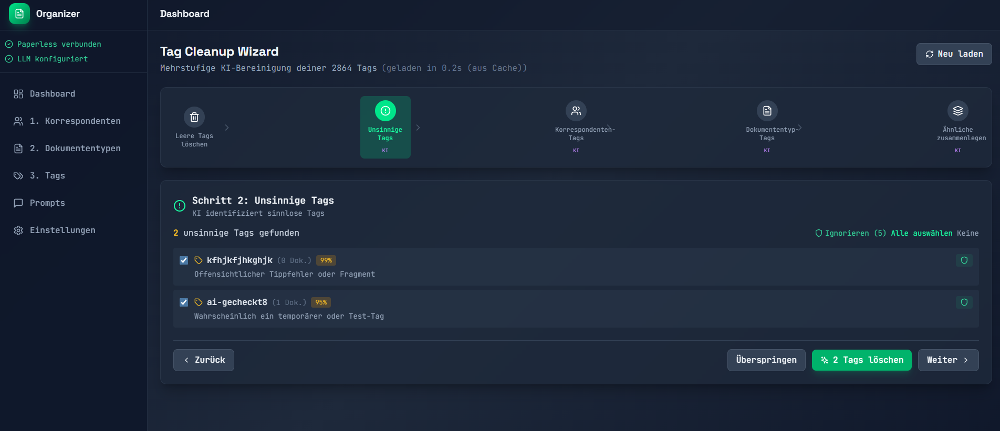
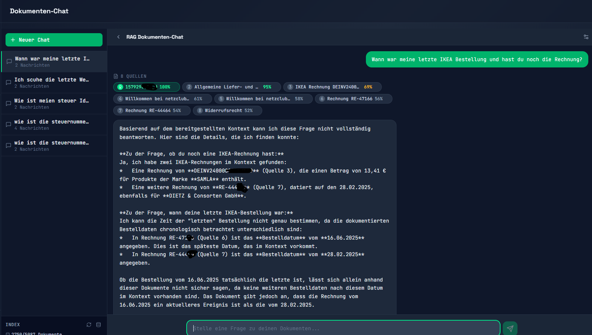
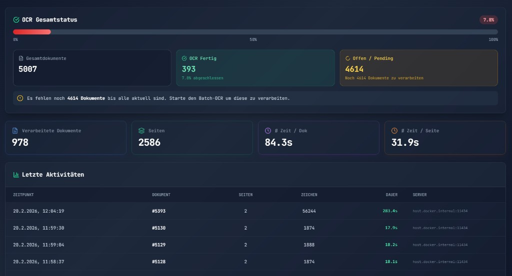
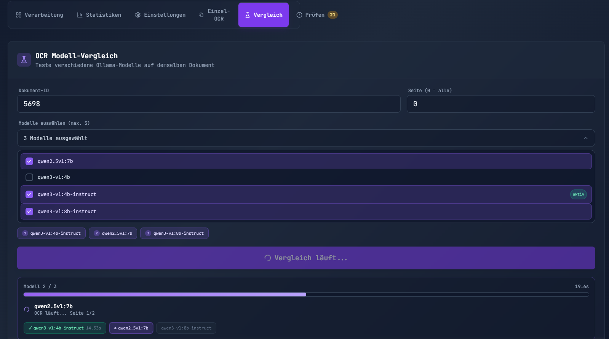

<div align="center">

# 🤖 AI Paperless Organizer

**The all-in-one companion for Paperless-ngx – far more than just classification**

[](https://github.com/syberx/AI-Paperless-Organizer)
[](https://hub.docker.com/r/webdienste/ai-paperless-organizer)
[](https://opensource.org/licenses/MIT)

[](https://ko-fi.com/chriswilms)
[](https://www.paypal.com/paypalme/withmoney)

**Classify · Clean up · OCR · Chat · Cloud import · Find duplicates – in one tool**

🇩🇪 [Deutsche Version](README.md) · 🇬🇧 **English**



</div>

> **⚠️ Beta – ALWAYS make a full Paperless-ngx backup before using this tool.**
> Under active development. It modifies documents, tags, correspondents and metadata inside your Paperless-ngx instance. **No warranty, no liability.** Use at your own risk.

---

## What is this?

Tools like Paperless-GPT or Paperless-AI classify documents **as they are imported**. That leaves the actual problem untouched: **the thousands of documents already sitting in your archive** – and whatever the automatic classification got wrong along the way.

AI Paperless Organizer is a full management and optimization suite for an existing Paperless-ngx archive.

| | Feature | What it does |
|---|---|---|
| ✨ | **AI classifier** | Title, tags, correspondent, type, date, storage path, custom fields – fully automatic, semi-automatic or manual |
| 🧠 | **Metadata cleanup** | Find and merge duplicate correspondents, tags and document types |
| 🧹 | **Tag Cleanup Wizard** | 5-step systematic tag cleanup |
| 📷 | **OCR (Ollama Vision)** | Re-OCR documents with local vision models – single, batch, watchdog |
| 🏆 | **Model benchmark** | Compare up to 5 OCR models or 4 LLM providers on the same document |
| 💬 | **Document chat (RAG)** | Ask your archive questions – with source attribution and hybrid search |
| ☁️ | **Cloud sync / import** | Google Drive, OneDrive, Dropbox, Nextcloud, local folders → Paperless |
| 🔍 | **Duplicate detection** | Exact duplicates, similar documents (AI), duplicate invoices |
| 🗑️ | **Junk cleanup** | Find and remove boilerplate documents (T&C, imprints, ...) |
| 📊 | **Dashboard & stats** | Progress, activity, time saved |

**In short:** everything Paperless-ngx is missing – fully automatic if you want it, with full control when you need it.

---

## The problem it solves

Your Paperless-ngx install has grown, and now you have:

- **Hundreds of duplicate correspondents** – "Telekom", "Deutsche Telekom", "Telekom GmbH", "DTAG"...
- **Junk tags** – typos, test tags, leftovers from Paperless-AI or Paperless-GPT
- **Chaotic document types** – "Invoice", "invoice", "Invoices", "Rechnung"...
- **Thousands of unclassified documents** – missing titles, tags, correspondents, wrong storage paths
- **No AI full-text search** – you can't just ask *"when does my phone contract expire?"*
- **No cloud import** – phone scans have to be uploaded by hand

---

## ✨ AI document classifier

The classifier reads the **content** of your documents and fills in every metadata field.

<div align="center">


*The AI analyzes document content and suggests all metadata*

</div>

| Field | Description |
|---|---|
| **Title** | A precise, content-based title (not "Document from Company X") |
| **Tags** | Matching tags from your existing tag list |
| **Correspondent** | Sender/issuer – searches your existing entries first |
| **Document type** | Picked from your existing types |
| **Storage path** | Smart assignment to a person/folder based on profiles |
| **Created date** | Extracts the real document date (invoice date, letter date, ...) |
| **Custom fields** | Anything: IBAN, invoice number, amount, customer number, ... |

**With OpenAI / cloud models (tool calling):** the model actively queries your Paperless data – it searches for matching tags, correspondents and document types in real time before deciding. Result: much better alignment with entries you already have.

**With Ollama (local models) ⭐ recommended:** a multi-stage pipeline – analysis → tags → document type → storage path → custom fields → verification. Everything local, no data leaves your server. Best results: **`qwen3:4b`** or **`qwen3:8b`** – Qwen3 reasons internally before answering, which noticeably improves classification quality over older non-reasoning models.

### Full control before anything is written

Every suggestion is editable before saving: change the title, add/remove individual tags with live search, override the correspondent, pick the storage path manually, correct custom fields. **"Apply & next"** gives you an assembly-line workflow.

Configurable: enable/disable individual fields, keep or replace existing tags, auto-shorten correspondent names ("Deutsche Telekom AG" → "Telekom"), strip legal forms (GmbH, AG, Ltd., ...), protected tags that are never removed, exclusion lists, and **custom prompts per field**.

### Storage path profiles

Describe **who** receives which documents (personal, business, family members, ...) – the AI reads that context and picks the matching path automatically, always with a short justification.

### Local vs. cloud – benchmark built in

Not sure which model fits your documents? Test **up to 4 providers simultaneously** on the same document, compare results side by side, and get a cost estimate. A typical finding: `gpt-4o-mini` delivers identical quality to `gpt-4o` for ~95% of documents, at a fraction of the price.

> ⚠️ **Privacy note:** the classifier sends the **OCR text** of your documents to the configured LLM. With cloud models, document content leaves your server. For maximum privacy use **Ollama** with local models – then nothing leaves your machine.

---

## 🧠 AI metadata cleanup

<div align="center">


*The AI groups similar correspondents with confidence scores*

</div>

The AI analyzes **only the names** of your metadata (e.g. "Telekom", "Invoice", "Tax 2024") – never document content. You get merge suggestions with confidence scores, and you decide.

Analyses are **cached**, so you can go through suggestions at your own pace without paying for the same AI call twice. Not sure whether two entries really belong together? Preview the underlying documents before merging.

---

## 🧹 Tag Cleanup Wizard

A 5-step assistant for systematic tag cleanup:

1. **Delete empty tags** – tags with no documents
2. **Junk tags** – the AI identifies typos, test tags and fragments
3. **Correspondent tags** – tags that are really companies/people
4. **Document type tags** – tags that are really document types
5. **Merge similar** – duplicates and variants

<div align="center">



</div>

---

## 💬 Document chat (RAG)

Ask questions against your entire Paperless archive – the AI searches all documents and answers **with source attribution**.

- **Hybrid search**: BM25 + ChromaDB semantic search + cross-encoder reranking
- **Streaming answers** with source attribution and citation highlighting
- **Query enrichment**: short follow-up questions are expanded automatically
- **German optimization**: cross-encoder tuned for German documents (mmarco-german)
- **Fact extraction**: dates of birth, addresses, tax numbers from chunks
- **Session management**: save chats and resume them later
- **Embeddings**: Ollama (`mxbai-embed-large`) or OpenAI

<div align="center">


*RAG chat with sources – "when was my last IKEA order?"*

</div>

> **Requires** RAG to be enabled in settings and the index to be built. Indexing runs in the background.

---

## 📷 OCR with Ollama Vision

Re-process documents with better text recognition, powered by local vision models:

- **Single OCR** – enter a document ID, compare old vs. new text, apply
- **Batch OCR** – all documents or only tagged ones
- **Multi-server failover** – configure several Ollama servers for resilience
- **Watchdog** – automatic OCR for new documents in the background
- **Tag-based workflow** – `runocr` and `ocrfinish` tags for flexible control
- **Memory-safe** – PDFs are rendered page by page, so RAM usage stays constant regardless of document length

<div align="center">



</div>

> 💡 Your documents never leave the server – Ollama runs locally.

### 🏆 OCR model comparison & AI benchmark

<div align="center">



</div>

Compare **up to 5 vision models** on the same document, page by page, each with its model-specific optimal prompt. Afterwards a cloud LLM can **grade the results across 10 categories** (names, dates, IBANs, amounts, addresses, form logic, completeness, formatting, hallucination, automatability) and recommend the best model for quality, speed and value.

| Model | Params | VRAM | Strength |
|---|---|---|---|
| **`qwen3-vl:4b-instruct`** | 4B | ~3 GB | Best all-rounder, reliable on IBANs |
| **`huihui_ai/qwen3-vl-abliterated:8b`** | 8B | ~6 GB | 8B without safety filters (detects IBANs) |
| **`glm-ocr`** | 1.1B | ~2 GB | Ultra fast, good on standard documents |
| **`minicpm-v`** | 8B | ~5.5 GB | Strong OCR benchmarks, multi-image |
| **`qwen2.5vl:7b`** | 7B | ~6 GB | Proven, good quality |

> ⚠️ The default `qwen3-vl:8b-instruct` has safety filters that redact sensitive fields such as IBANs. For complete transcription use the **abliterated** variant or `4b-instruct`.

---

## ☁️ Cloud sync / import

Import documents into Paperless-ngx automatically from cloud storage or local folders.

| Source | Connection | Auth |
|---|---|---|
| **Google Drive** | Automatic OAuth flow in the browser | One-time sign-in |
| **OneDrive** | Automatic OAuth flow in the browser | One-time sign-in |
| **Dropbox** | Automatic OAuth flow in the browser | One-time sign-in |
| **Nextcloud / WebDAV** | URL + username/password | No API key |
| **Local folder** | Docker volume path | No setup |

Per source you get a folder browser, filename prefixes, automatic tags/correspondent/document type on import, keep-or-delete after import, a configurable polling interval and a full import history. A background sync daemon checks all sources automatically.

Google Drive, OneDrive and Dropbox need port `53682` exposed for the OAuth callback – no API key, no developer account, no terminal required.

---

## 🔍 Duplicate detection

| Level | Method | Duration (~5000 docs) |
|---|---|---|
| **Exact duplicates** | Checksum comparison | Seconds |
| **Similar documents** | AI embedding comparison (ChromaDB) | ~1–2 minutes |
| **Duplicate invoices** | LLM extracts invoice no. + amount | Hours (background job) |

Configurable similarity threshold (80–100%), results grouped with direct links into Paperless-ngx, an ignore list for confirmed non-duplicates, and **no automatic deletion** – you review and decide.

---

## 🔒 Privacy

| Feature | What is sent to the LLM |
|---|---|
| **Metadata cleanup & Tag Wizard** | **Only metadata names** – names of tags, correspondents, document types, and their document counts. **No document content, ever.** |
| **AI classifier** | The **OCR text** of the document being classified |
| **Document chat (RAG)** | The **text chunks** retrieved for your question |
| **OCR** | The **page images** being transcribed |

With **Ollama**, all of the above stays on your own server. With cloud providers (OpenAI, Mistral, Anthropic, Azure, OpenRouter), the listed data is sent to that provider.

---

## 🚀 Quick start

### Compatibility

**Works with Paperless-ngx 2.x and 3.x.** Last verified against **Paperless-ngx 3.1.3** (PostgreSQL), both reading and writing: fetching and filtering documents, `PATCH` on title/date/tags/correspondent/type/storage path/custom fields, `bulk_edit` with `modify_tags`, `set_correspondent` and `set_document_type`, plus creating tags and correspondents.

The tool does not pin an API version and follows the server default (v10 on 3.1.3); the fields it uses are identical to v9.

### Option 1: Docker Hub (recommended)

```yaml
# docker-compose.yml
services:
  backend:
    image: webdienste/ai-paperless-organizer:backend-latest
    ports:
      - "8000:8000"
    volumes:
      - ./data:/app/data
    environment:
      - DATABASE_URL=sqlite+aiosqlite:///./data/organizer.db
    restart: unless-stopped
    mem_limit: 3g

  frontend:
    image: webdienste/ai-paperless-organizer:frontend-latest
    ports:
      - "3001:80"
    depends_on:
      - backend
    restart: unless-stopped
```

```bash
docker compose up -d
```

### Option 2: Build it yourself

```bash
git clone https://github.com/syberx/AI-Paperless-Organizer.git
cd AI-Paperless-Organizer
docker compose up -d --build
```

**Web interface:** http://localhost:3001

---

## ⚙️ Configuration

### 1. Connect Paperless-ngx

Go to **Settings → Paperless-ngx**, enter your URL (e.g. `https://paperless.example.com`) and an API token (*Paperless admin → Auth Tokens → new token*), then **test the connection**.

### 2. Set up an LLM provider

| Provider | API key from | Recommended model | Metadata cleanup | Classifier |
|---|---|---|---|---|
| **OpenAI** | [platform.openai.com](https://platform.openai.com/api-keys) | `gpt-4o-mini` / `gpt-4o` | ✅ Tested | ✅ Tested |
| **Mistral** | [console.mistral.ai](https://console.mistral.ai/) | `mistral-small-latest` | 🔄 Beta | ✅ Tested |
| **OpenRouter** | [openrouter.ai/keys](https://openrouter.ai/keys) | `mistral/mistral-large-2411` | ❌ | ✅ Tested |
| **Ollama** ⭐ | No key needed | `qwen3:4b` / `qwen3:8b` | 🔄 Beta | ✅ Recommended |
| **Anthropic** | [console.anthropic.com](https://console.anthropic.com/) | `claude-3-5-sonnet` | 🔄 Beta | 🔄 Beta |
| **Azure** | Azure Portal | your deployment | 🔄 Beta | 🔄 Beta |

> 💡 **OpenRouter tip:** one API key gives you Mistral Large, Llama 3.3 70B, Gemini 2.0 Flash, Claude 3.5 Haiku and 300+ more models – ideal for the benchmark without juggling separate keys.

### 3. Go

Provider assignment is central under **Settings** – configure once which provider handles which task (classification, OCR, RAG chat). Then enable the classifier fields you want, pick an OCR model, and build the RAG index.

---

## 📖 Recommended workflow

**One-time metadata cleanup:** correspondents → document types → tags. For each: remove empty entries, run the AI analysis, review suggestions (preview documents if unsure), then merge or ignore. Start with **correspondents** – they are the most important foundation.

**Ongoing classification:** improve OCR (optional) → classify → review & save.

---

## 🛠️ Tech stack

| Area | Technology |
|---|---|
| **Backend** | Python 3.11, FastAPI, SQLAlchemy (async), httpx |
| **Frontend** | React 18, TypeScript, Vite, TailwindCSS |
| **Database** | SQLite + ChromaDB (RAG vectors) + BM25 index |
| **Container** | Docker, Docker Compose |
| **LLM** | OpenAI, Mistral, Anthropic, Azure, OpenRouter, Ollama |
| **OCR** | Ollama Vision API (qwen3-vl, glm-ocr, minicpm-v, ...) |
| **RAG** | ChromaDB + BM25 hybrid search, sentence-transformers cross-encoder |
| **Cloud import** | rclone (Google Drive, OneDrive, Dropbox), WebDAV, local folders |

---

## ⚠️ Current state

**Tested & stable:** OpenAI (GPT-4o, GPT-4o-mini, GPT-4.1), Ollama (qwen3-vl, llama3.1, ...).

Other providers (Anthropic, Azure) are implemented but not yet extensively tested. Bug reports welcome.

---

## 🤝 Contributing

Contributions are welcome – fork, branch, commit, push, open a PR.

Issues especially welcome for: 🐛 bug reports · 💡 feature requests · 🔌 testing other LLM providers.

Questions and ideas: [GitHub Discussions](https://github.com/syberx/AI-Paperless-Organizer/discussions)

---

## 💖 Support

If this project saves you time, you can support its development:

<div align="center">

[](https://ko-fi.com/chriswilms)
[](https://www.paypal.com/paypalme/withmoney)

</div>

---

## 📄 License

MIT – see [LICENSE](LICENSE).

---

<div align="center">

Made with ❤️ for the Paperless-ngx community

</div>
