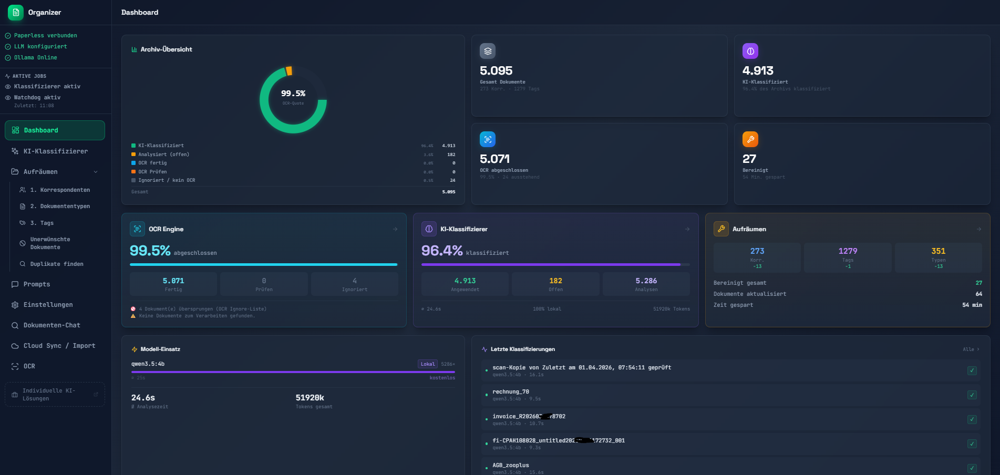
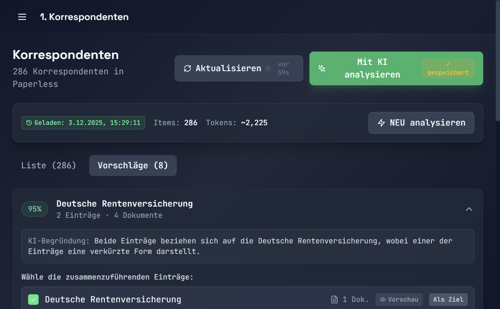
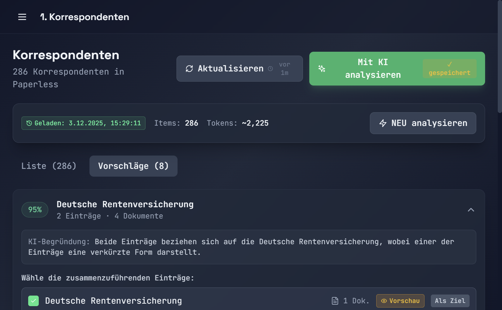

<div align="center">

# 🤖 AI Paperless Organizer

**KI-gestützte Metadaten-Bereinigung für Paperless-ngx**

[](https://github.com/syberx/AI-Paperless-Organizer)
[](https://hub.docker.com/r/webdienste/ai-paperless-organizer)
[](https://opensource.org/licenses/MIT)

[](https://ko-fi.com/chriswilms)
[](https://www.paypal.com/paypalme/withmoney)

---

**Bringe Ordnung in deine Paperless-ngx Metadaten mit der Kraft der KI!**

Korrespondenten, Tags und Dokumententypen intelligent analysieren, gruppieren und zusammenführen.

</div>

---

## 📸 Screenshots

<div align="center">

### Dashboard

*Übersicht mit Statistiken und empfohlenem Workflow*

### KI-Analyse

*Intelligente Gruppierung ähnlicher Einträge mit Konfidenz-Werten*

### Merge-Vorschau

*Dokument-Vorschau vor dem Zusammenführen*

</div>


---

## ✨ Features

| Feature | Beschreibung |
|---------|--------------|
| 🧠 **KI-Analyse** | Findet automatisch ähnliche Einträge (z.B. "do", "do gmbh", "Domain Offensive GmbH") |
| 🔌 **Multi-LLM** | OpenAI, Anthropic Claude, Azure OpenAI, Ollama (lokal & kostenlos) |
| 👁️ **Dokument-Vorschau** | Sieh dir Dokumente an bevor du zusammenführst |
| ✅ **Hybrid-Workflow** | KI schlägt vor, du entscheidest, System führt aus |
| 📝 **Anpassbare Prompts** | Eigene Prompts für verschiedene Entitätstypen |
| 📊 **Statistiken** | Dashboard mit Cleanup-Fortschritt und Zeitersparnis |
| 🔒 **Passwort-Schutz** | Optionaler UI-Schutz mit Passwort |
| 🗑️ **Leere entfernen** | Ein-Klick Löschung von ungenutzten Einträgen |

---

## 🚀 Quick Start

### Option 1: Docker Hub (Empfohlen)

```yaml
# docker-compose.yml
services:
  backend:
    image: webdienste/ai-paperless-organizer:backend-latest
    ports:
      - "8000:8000"
    volumes:
      - ./data:/app/data
    environment:
      - DATABASE_URL=sqlite+aiosqlite:///./data/organizer.db

  frontend:
    image: webdienste/ai-paperless-organizer:frontend-latest
    ports:
      - "3001:80"
    depends_on:
      - backend
```

```bash
docker-compose up -d
```

### Option 2: Selbst bauen

```bash
git clone https://github.com/syberx/AI-Paperless-Organizer.git
cd AI-Paperless-Organizer
docker-compose up -d --build
```

### 🌐 Öffnen

**Webinterface:** http://localhost:3001

---

## ⚙️ Konfiguration

### 1. Paperless-ngx verbinden

1. Gehe zu **Einstellungen** → Paperless-ngx
2. URL eingeben (z.B. `https://paperless.example.com`)
3. API Token aus Paperless: *Admin → Auth Tokens → Neuer Token*
4. **Verbindung testen**

### 2. LLM Provider einrichten

| Provider | API Key von | Empfohlenes Modell |
|----------|-------------|-------------------|
| **OpenAI** | [platform.openai.com](https://platform.openai.com/api-keys) | `gpt-4o` |
| **Anthropic** | [console.anthropic.com](https://console.anthropic.com/) | `claude-3-5-sonnet-20241022` |
| **Ollama** | Kein Key nötig! | `llama3.1`, `mistral` |
| **Azure** | Azure Portal | Dein Deployment |

> 💡 **Tipp:** Mit Ollama kannst du komplett kostenlos und lokal arbeiten!

---

## 📖 Verwendung

### Empfohlener Workflow

```
1️⃣ Korrespondenten    →    2️⃣ Dokumententypen    →    3️⃣ Tags
```

### Für jeden Bereich:

1. **Leere entfernen** - Lösche ungenutzte Einträge (0 Dokumente)
2. **Mit KI analysieren** - Finde ähnliche Einträge
3. **Prüfen & Zusammenführen** - Bestätige oder ignoriere Vorschläge

### Dokument-Vorschau

Klicke auf 👁️ **Vorschau** bei jedem Eintrag um die zugehörigen Dokumente zu sehen - so erkennst du ob eine Gruppierung wirklich passt!

---

## 🏗️ Architektur

```
┌─────────────────────────────────────────────────────────────┐
│                     Docker Compose                          │
├─────────────────────┬───────────────────────────────────────┤
│   Frontend (React)  │           Backend (FastAPI)           │
│   Port: 3001        │           Port: 8000                  │
│                     │                                       │
│   • Dashboard       │   • Paperless API Client              │
│   • Korrespondenten │   • LLM Provider Layer                │
│   • Tags            │   • Similarity Service                │
│   • Dokumententypen │   • Merge Service                     │
│   • Settings        │   • SQLite (Config/History)           │
└─────────────────────┴───────────────────────────────────────┘
                              │
                              ▼
                    ┌─────────────────┐
                    │  Paperless-ngx  │
                    │      API        │
                    └─────────────────┘
```

---

## 🛠️ Tech Stack

| Bereich | Technologie |
|---------|-------------|
| **Backend** | Python 3.11, FastAPI, SQLAlchemy, httpx |
| **Frontend** | React 18, TypeScript, Vite, TailwindCSS |
| **Database** | SQLite |
| **Container** | Docker, Docker Compose |
| **LLM** | OpenAI, Anthropic, Azure, Ollama |

---

## 🤝 Beitragen

Beiträge sind willkommen! 

1. Fork das Repository
2. Erstelle einen Feature Branch (`git checkout -b feature/AmazingFeature`)
3. Commit deine Änderungen (`git commit -m 'Add AmazingFeature'`)
4. Push zum Branch (`git push origin feature/AmazingFeature`)
5. Öffne einen Pull Request

---

## 💖 Unterstützen

Wenn dir dieses Projekt gefällt, kannst du mich unterstützen:

<div align="center">

[](https://ko-fi.com/chriswilms)
[](https://www.paypal.com/paypalme/withmoney)

</div>

---

## 📄 Lizenz

Dieses Projekt ist unter der MIT-Lizenz lizenziert - siehe [LICENSE](LICENSE) für Details.

---

<div align="center">

**Made with ❤️ for the Paperless-ngx Community**

[⬆ Nach oben](#-ai-paperless-organizer)

</div>
