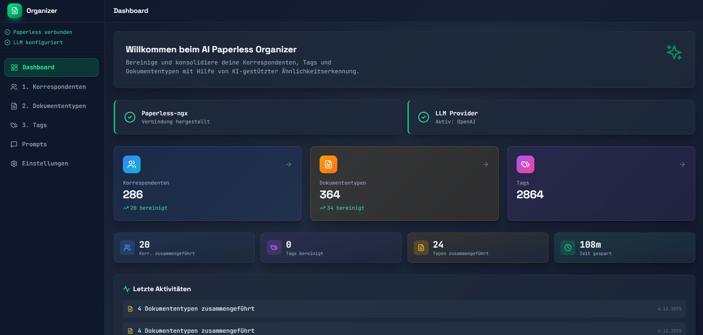
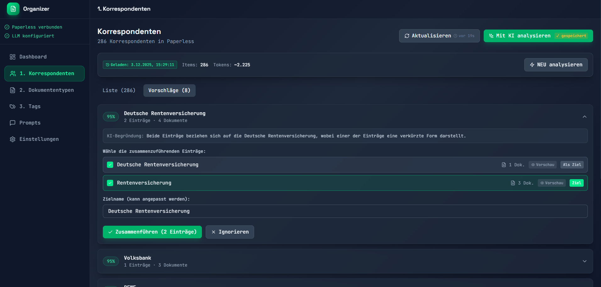
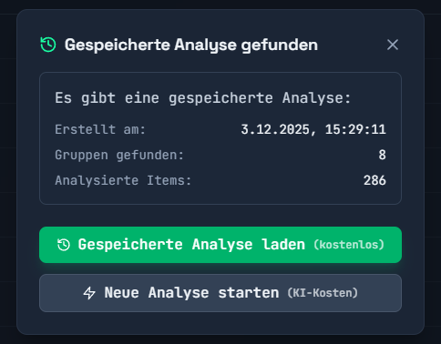
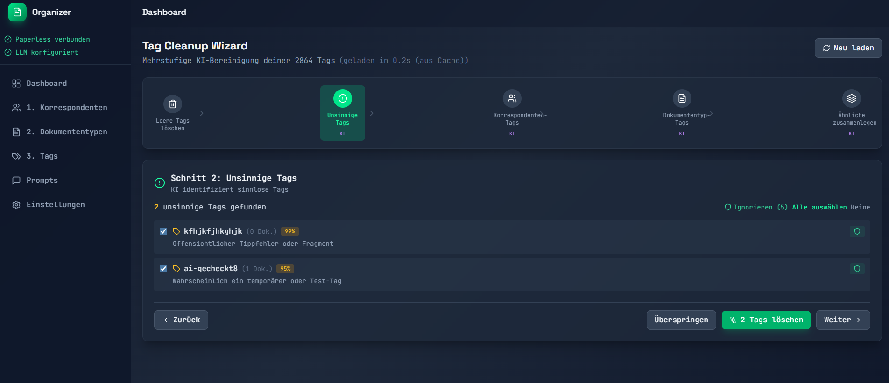

<div align="center">

# 🤖 AI Paperless Organizer

**KI-gestützte Metadaten-Bereinigung & OCR für Paperless-ngx**

[](https://github.com/syberx/AI-Paperless-Organizer)
[](https://hub.docker.com/r/webdienste/ai-paperless-organizer)
[](https://opensource.org/licenses/MIT)

[](https://ko-fi.com/chriswilms)
[](https://www.paypal.com/paypalme/withmoney)

</div>

---

## 😫 Das Problem

Kennst du das? Deine **Paperless-ngx** Installation ist über die Zeit gewachsen und jetzt hast du:

- **Hunderte doppelte Korrespondenten**: "Telekom", "Deutsche Telekom", "Telekom GmbH", "DTAG"...
- **Unzählige unsinnige Tags**: Tippfehler, Test-Tags, automatisch generierte Einträge von Paperless-AI oder Paperless-GPT
- **Chaos bei Dokumententypen**: "Rechnung", "Invoice", "Rechnungen", "rechnung"...

Tools wie **Paperless-AI**, **Paperless-GPT** oder einfach jahrelange Nutzung hinterlassen ein Metadaten-Chaos, das manuell kaum zu bereinigen ist.

## ✨ Die Lösung

**AI Paperless Organizer** analysiert deine gesamten Metadaten mit KI und schlägt intelligente Zusammenführungen vor:

<div align="center">


*Dashboard mit Statistiken und Fortschritt*

</div>

---

## 🎯 Features

### 🧠 KI-gestützte Ähnlichkeitserkennung
Die KI findet automatisch zusammengehörige Einträge - auch bei unterschiedlichen Schreibweisen, Abkürzungen oder Tippfehlern.

<div align="center">


*KI gruppiert ähnliche Korrespondenten mit Konfidenz-Werten*

</div>

### 💾 Analyse-Ergebnisse zwischenspeichern
KI-Analysen werden gespeichert und können **kostenlos** wieder geladen werden. So kannst du die Vorschläge in Ruhe durchgehen, ohne jedes Mal neue KI-Kosten zu verursachen.

<div align="center">


*Gespeicherte Analyse laden oder neue starten*

</div>

### 🧹 Tag Cleanup Wizard
5-stufiger Assistent zur systematischen Tag-Bereinigung:

1. **Leere Tags löschen** - Tags ohne Dokumente entfernen
2. **Unsinnige Tags** - KI identifiziert Tippfehler, Test-Tags, Fragmente
3. **Korrespondenten-Tags** - Tags die eigentlich Firmen/Personen sind
4. **Dokumententyp-Tags** - Tags die eigentlich Dokumententypen sind
5. **Ähnliche zusammenlegen** - Duplikate und Varianten zusammenführen

<div align="center">


*Tag Cleanup Wizard erkennt unsinnige Tags automatisch*

</div>

### 📝 Prompts anpassen
Nicht zufrieden mit den KI-Vorschlägen? Passe die Prompts an deine Bedürfnisse an! Die KI verwendet deine individuellen Anweisungen für bessere Ergebnisse.

### 👁️ Dokument-Vorschau
Unsicher ob zwei Einträge wirklich zusammengehören? Schau dir die zugehörigen Dokumente direkt an, bevor du zusammenführst.

### 📊 Statistiken & Fortschritt
Behalte den Überblick: Wie viele Einträge wurden bereinigt? Wie viel Zeit gespart? Letzte Aktivitäten auf einen Blick.

### 🔍 OCR mit Ollama Vision
Dokumente mit besserer OCR-Erkennung neu verarbeiten – powered by **Ollama Vision Models** (z.B. `qwen2.5vl:7b`):

- **Einzel-OCR**: Dokument-ID eingeben, alten und neuen Text vergleichen, übernehmen
- **Batch-OCR**: Alle Dokumente oder nur getaggte in einem Durchlauf verarbeiten
- **Multi-Server Failover**: Mehrere Ollama-Server konfigurieren für Ausfallsicherheit
- **Statistiken**: Verarbeitete Seiten, Zeichen, Dauer pro Dokument im Überblick
- **Watchdog**: Automatische OCR-Verarbeitung neuer Dokumente im Hintergrund
- **Tag-basierter Workflow**: `runocr` und `ocrfinish` Tags für flexible Steuerung

> 💡 **Vorteil:** Deine Dokumente verlassen nie den Server – Ollama läuft lokal!

### 🗑️ Dokumente Aufräumen
Junk-Dokumente wie AGB, Widerrufsbelehrungen und Datenschutzerklärungen automatisch finden und entfernen:

- **Titel-basierte Suche**: Findet nur Dokumente mit typischen Junk-Titeln (keine falschen Treffer bei normalen Dokumenten)
- **Kartenansicht mit Vorschaubildern**: Große Thumbnails für schnelle visuelle Prüfung
- **Mehrfachauswahl**: Einzeln oder alle auf einmal auswählen
- **Bestätigungsdialog**: Sicherheitsabfrage vor endgültiger Löschung
- **Standard-Suchbegriffe**: AGB, Widerruf, Datenschutzerklärung, Impressum, Nutzungsbedingungen u.v.m.

---

## ⚠️ Hinweis zum aktuellen Stand

> **Aktuell getestet:** OpenAI (GPT-4o, GPT-4o-mini)
> 
> Andere LLM-Provider (Anthropic, Ollama, Azure) sind implementiert, aber noch nicht ausführlich getestet. Bei Problemen gerne ein Issue erstellen - wir verbessern kontinuierlich!

---

## 🔒 Datenschutz

**Wichtig:** An das LLM werden **ausschließlich Metadaten** übermittelt:
- Namen von Tags, Korrespondenten und Dokumententypen
- Anzahl der zugehörigen Dokumente

**❌ Es werden KEINE Dokumenteninhalte, Texte oder Dateien an das LLM gesendet!**

Die KI sieht nur die Namen deiner Metadaten (z.B. "Telekom", "Rechnung", "Steuer 2024") um Ähnlichkeiten zu erkennen - niemals den Inhalt deiner Dokumente.

> 💡 **Tipp:** Für maximalen Datenschutz nutze **Ollama** mit lokalen Modellen - dann verlassen keine Daten deinen Server!

---

## 🚀 Quick Start

### Option 1: Docker Hub (Empfohlen)

```yaml
# docker-compose.yml
services:
  backend:
    image: webdienste/ai-paperless-organizer:backend-latest
    ports:
      - "8000:8000"
    volumes:
      - ./data:/app/data
    environment:
      - DATABASE_URL=sqlite+aiosqlite:///./data/organizer.db

  frontend:
    image: webdienste/ai-paperless-organizer:frontend-latest
    ports:
      - "3001:80"
    depends_on:
      - backend
```

```bash
docker-compose up -d
```

### Option 2: Selbst bauen

```bash
git clone https://github.com/syberx/AI-Paperless-Organizer.git
cd AI-Paperless-Organizer
docker-compose up -d --build
```

### 🌐 Öffnen

**Webinterface:** http://localhost:3001

---

## ⚙️ Konfiguration

### 1. Paperless-ngx verbinden

1. Gehe zu **Einstellungen** → Paperless-ngx
2. URL eingeben (z.B. `https://paperless.example.com`)
3. API Token aus Paperless: *Admin → Auth Tokens → Neuer Token*
4. **Verbindung testen**

### 2. LLM Provider einrichten

| Provider | API Key von | Empfohlenes Modell | Status |
|----------|-------------|-------------------|--------|
| **OpenAI** | [platform.openai.com](https://platform.openai.com/api-keys) | `gpt-4o` | ✅ Getestet |
| **Anthropic** | [console.anthropic.com](https://console.anthropic.com/) | `claude-3-5-sonnet` | 🔄 Beta |
| **Ollama** | Kein Key nötig! | `llama3.1` | 🔄 Beta |
| **Azure** | Azure Portal | Dein Deployment | 🔄 Beta |

### 3. Sensible Daten schützen

1. **Backend-Datenbank nie committen** – dank `.gitignore` und `backend/.dockerignore` wird `backend/data/organizer.db` automatisch ausgeschlossen. Vor einem Commit kannst du mit `python scripts/sanitize_data.py` (optional `--dry-run`) alle echten SQLite-Dateien aus dem Data-Ordner entfernen.
2. **Docker-Builds bleiben sauber** – der neue `backend/.dockerignore` verhindert, dass lokale Dumps in Images landen. Für produktive Instanzen mountest du wie gehabt ein leeres Volume (`./backend/data:/app/data`).
3. **Screenshots** – bleiben erhalten, aber prüfe vor Veröffentlichung, ob keine vertraulichen Informationen zu sehen sind.

---

## 📖 Empfohlener Workflow

```
1️⃣ Korrespondenten    →    2️⃣ Dokumententypen    →    3️⃣ Tags
```

### Für jeden Bereich:

1. **Leere entfernen** - Ungenutzte Einträge (0 Dokumente) löschen
2. **Mit KI analysieren** - Ähnliche Einträge finden lassen
3. **Vorschläge prüfen** - Bei Bedarf Dokumente ansehen
4. **Zusammenführen oder Ignorieren** - Du entscheidest!

### Tipps:
- Beginne mit **Korrespondenten** - sie sind die wichtigste Basis
- Nutze den **Tag Cleanup Wizard** für systematische Tag-Bereinigung
- **Gespeicherte Analysen** sparen KI-Kosten beim erneuten Öffnen

---

## 🏗️ Architektur

```
┌─────────────────────────────────────────────────────────────┐
│                     Docker Compose                          │
├─────────────────────┬───────────────────────────────────────┤
│   Frontend (React)  │           Backend (FastAPI)           │
│   Port: 3001        │           Port: 8000                  │
│                     │                                       │
│   • Dashboard       │   • Paperless API Client              │
│   • Korrespondenten │   • LLM Provider (OpenAI, etc.)       │
│   • Tags            │   • Similarity Service                │
│   • Dokumententypen │   • Merge Service                     │
│   • Tag Wizard      │   • OCR Service (Ollama Vision)       │
│   • OCR Manager     │   • Cleanup Service                   │
│   • Aufräumen       │   • SQLite (Cache/History)            │
│   • Prompts         │                                       │
└─────────────────────┴───────────────────────────────────────┘
                          │               │
                          ▼               ▼
                ┌─────────────┐   ┌─────────────┐
                │ Paperless   │   │   Ollama     │
                │    -ngx     │   │  (lokal)     │
                └─────────────┘   └─────────────┘
```

---

## 🛠️ Tech Stack

| Bereich | Technologie |
|---------|-------------|
| **Backend** | Python 3.11, FastAPI, SQLAlchemy, httpx |
| **Frontend** | React 18, TypeScript, Vite, TailwindCSS |
| **Database** | SQLite (für Cache, History, Einstellungen) |
| **Container** | Docker, Docker Compose |
| **LLM** | OpenAI, Anthropic, Azure, Ollama |
| **OCR** | Ollama Vision API (qwen2.5vl, llava, etc.) |

---

## 🤝 Beitragen

Beiträge sind willkommen! 

1. Fork das Repository
2. Erstelle einen Feature Branch (`git checkout -b feature/AmazingFeature`)
3. Commit deine Änderungen (`git commit -m 'Add AmazingFeature'`)
4. Push zum Branch (`git push origin feature/AmazingFeature`)
5. Öffne einen Pull Request

### Issues willkommen für:
- 🐛 Bug Reports
- 💡 Feature Requests  
- 🔌 Andere LLM Provider testen
- 🌍 Übersetzungen

---

## 💖 Unterstützen

Wenn dir dieses Projekt gefällt und Zeit spart, kannst du mich unterstützen:

<div align="center">

[](https://ko-fi.com/chriswilms)
[](https://www.paypal.com/paypalme/withmoney)

</div>

---

## 📄 Lizenz

Dieses Projekt ist unter der MIT-Lizenz lizenziert - siehe [LICENSE](LICENSE) für Details.

---

<div align="center">

**Made with ❤️ for the Paperless-ngx Community**

*Endlich Ordnung in deinen Metadaten!*

[⬆ Nach oben](#-ai-paperless-organizer)

</div>
