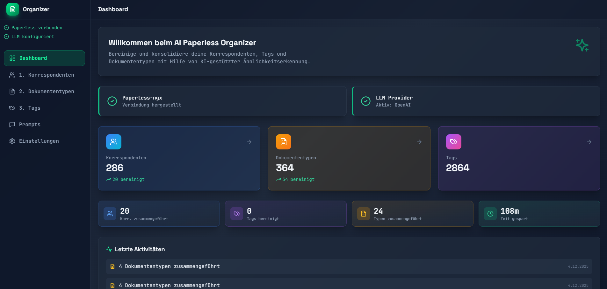
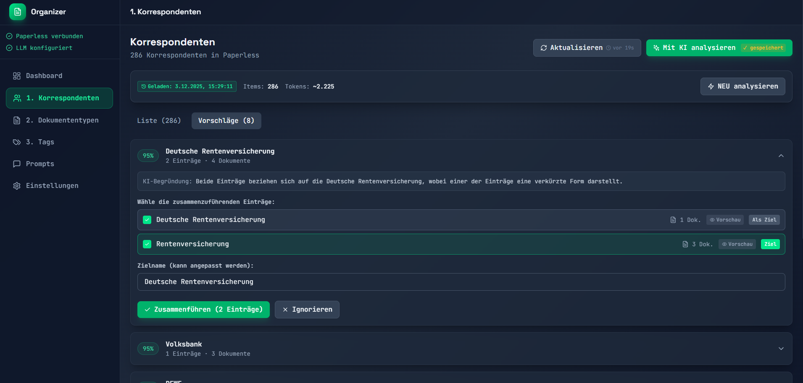
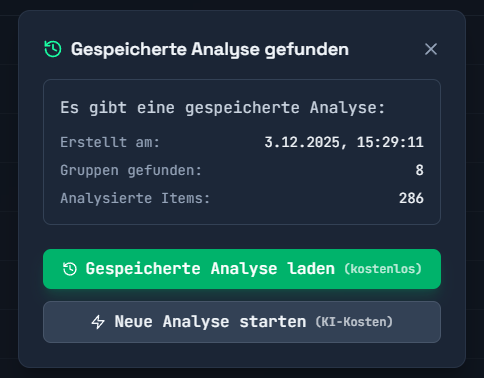
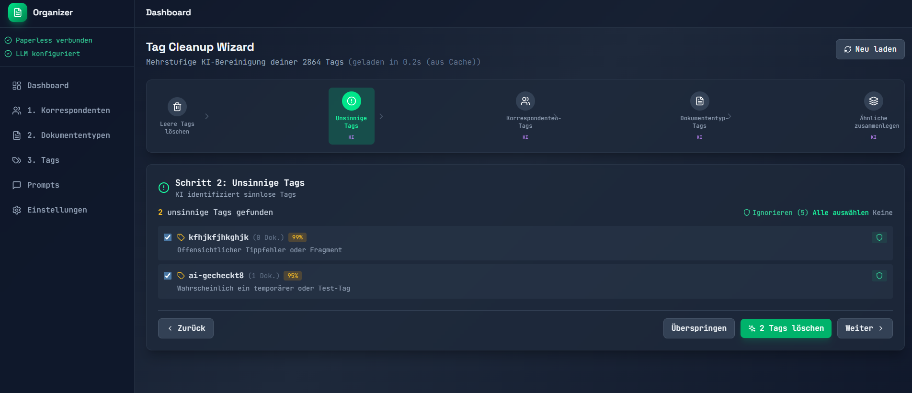
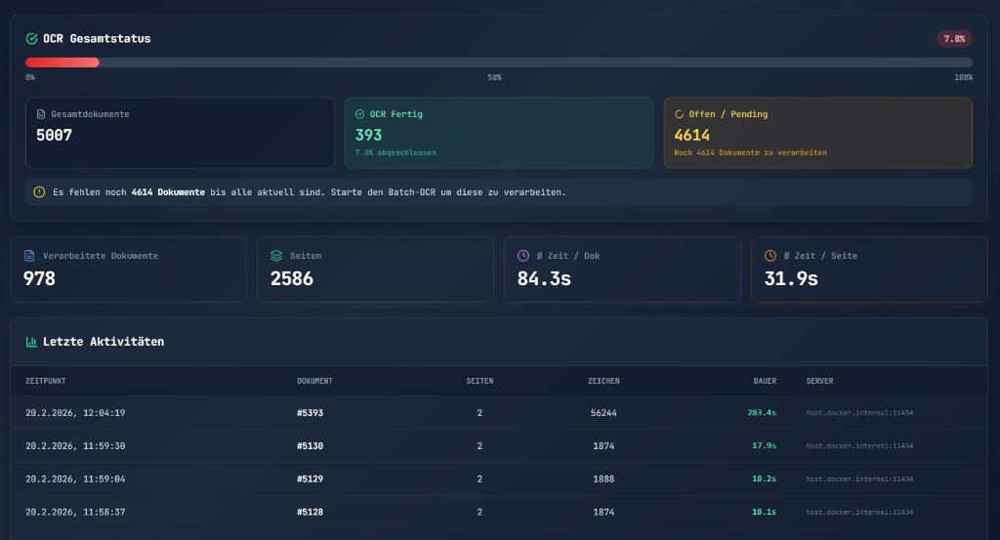
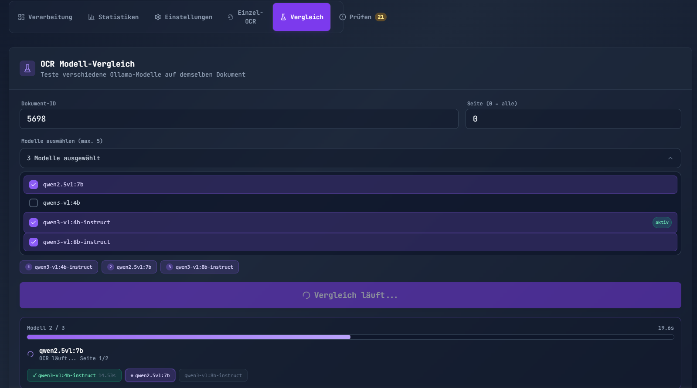
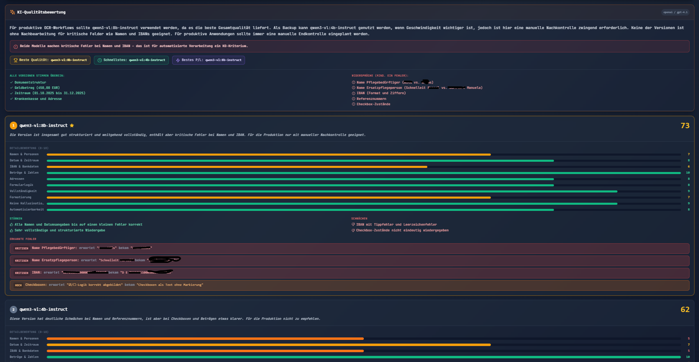

<div align="center">

# 🤖 AI Paperless Organizer

**Der intelligenteste Weg, Paperless-ngx zu organisieren – KI-Klassifizierung, Metadaten-Bereinigung & OCR in einem Tool**

[](https://github.com/syberx/AI-Paperless-Organizer)
[](https://hub.docker.com/r/webdienste/ai-paperless-organizer)
[](https://opensource.org/licenses/MIT)

[](https://ko-fi.com/chriswilms)
[](https://www.paypal.com/paypalme/withmoney)

</div>

> **⚠️ Frueher Betatest – Bitte vor der Nutzung IMMER ein vollstaendiges Paperless-ngx Backup erstellen!**
> Dieses Projekt befindet sich in aktiver Entwicklung. Es werden Dokumente, Tags, Korrespondenten und Metadaten in Paperless-ngx veraendert. Fehler koennen vorkommen. **Keine Garantie, keine Haftung bei Datenverlust oder fehlerhaften Aenderungen.** Nutzung auf eigenes Risiko.

---

## 🚀 Warum AI Paperless Organizer?

Es gibt andere Tools die Dokumente beim Import klassifizieren – aber sie lösen nicht das eigentliche Problem: **Was ist mit den Tausenden Dokumenten die bereits in deinem System schlummern?** Und was wenn die automatische Klassifizierung Fehler gemacht hat?

**AI Paperless Organizer** setzt den Fokus auf **Flexibilität, Tiefe und Kontrolle** – du entscheidest wie viel die KI alleine macht:

- ⚡ **Drei Modi: Vollautomatisch, Halb-automatisch oder Manuell** – Lass die KI alles sofort anwenden, nur unsichere Ergebnisse zur Prüfung vorlegen, oder jeden Vorschlag selbst abnehmen. Du stellst ein was du willst.
- 📂 **Speicherpfad-Profile** – Konfiguriere Personen-Profile (privat, geschäftlich, Kinder, Partner) mit Kontext-Beschreibung. Die KI ordnet Dokumente automatisch dem richtigen Ordner zu – inklusive Begründung.
- 🔧 **Custom Fields** – Extrahiere beliebige Felder direkt aus dem Dokumentinhalt: IBAN, Rechnungsnummer, Betrag, Kundennummer, Vertragsnummer, ... vollständig konfigurierbar.
- 🚫 **Feingranulare Ausschlüsse & Schutzmechanismen** – Geschützte Tags die nie entfernt werden, Dokumente mit bestimmten Tags/Korrespondenten komplett überspringen, einzelne Felder deaktivieren.
- ✏️ **Prompts pro Feld anpassen** – Individuelle Anweisung für Titel, Tags, Korrespondent, Typ und Datum. Die KI macht genau was du ihr sagst.
- 🏆 **Lokal vs. Cloud Benchmark** – Teste bis zu 4 LLM-Provider gleichzeitig auf demselben Dokument und finde heraus welches Modell für deine Dokumente am besten passt – ohne Bauchgefühl.
- 🧹 **Metadaten-Bereinigung** – Nicht nur klassifizieren, sondern auch das bestehende Chaos aufräumen: doppelte Korrespondenten, unsinnige Tags, Dokumententyp-Duplikate zusammenführen.
- 📷 **OCR mit Ollama Vision** – Bessere Texterkennung für Scans, mit Watchdog für automatische Verarbeitung neuer Dokumente.

> 💡 **Kurz gesagt:** Vollautomatisch wenn du willst – mit voller Kontrolle wenn du sie brauchst.

---

## 😫 Das Problem

Kennst du das? Deine **Paperless-ngx** Installation ist über die Zeit gewachsen und jetzt hast du:

- **Hunderte doppelte Korrespondenten**: "Telekom", "Deutsche Telekom", "Telekom GmbH", "DTAG"...
- **Unzählige unsinnige Tags**: Tippfehler, Test-Tags, automatisch generierte Einträge von Paperless-AI oder Paperless-GPT
- **Chaos bei Dokumententypen**: "Rechnung", "Invoice", "Rechnungen", "rechnung"...
- **Tausende unklassifizierte Dokumente**: Fehlende Titel, Tags, Korrespondenten, falsche Speicherpfade

**AI Paperless Organizer** löst das alles – in einem Tool, mit voller Kontrolle.

## ✨ Die Lösung

<div align="center">


*Dashboard mit Statistiken und Fortschritt*

</div>

---

## 🎯 Features im Überblick

| Feature | Beschreibung |
|---------|-------------|
| ✨ **KI-Dokumenten-Klassifizierer** | Liest Dokumentinhalt, setzt Titel, Tags, Korrespondent, Typ, Speicherpfad, Custom Fields |
| 🧠 **Metadaten-Bereinigung** | Findet & führt doppelte Korrespondenten, Tags, Dokumententypen zusammen |
| 📷 **OCR mit Ollama Vision** | Bessere Texterkennung für Scans mit lokalen KI-Modellen |
| 🏆 **Modell-Benchmark** | Vergleicht lokal vs. Cloud – bis zu 4 Provider gleichzeitig |
| 🧹 **Tag Cleanup Wizard** | 5-stufiger Assistent zur systematischen Tag-Bereinigung |
| 🗑️ **Dokumente Aufräumen** | Findet und entfernt Junk-Dokumente (AGB, Impressum, etc.) |
| 💾 **Analyse-Cache** | KI-Analysen speichern und kostenlos wieder laden |
| 📊 **Statistiken** | Fortschritt, gesparte Zeit, letzte Aktivitäten |

---

## ✨ KI-Dokumenten-Klassifizierer

Der Klassifizierer liest den **Inhalt** deiner Dokumente und befüllt automatisch alle Metadaten-Felder:

<div align="center">


*KI analysiert Dokumentinhalt und schlägt alle Metadaten vor*

</div>

### Was wird klassifiziert?

| Feld | Beschreibung |
|------|-------------|
| **Titel** | Präziser, inhaltsbasierter Titel (nicht "Dokument von Firma X") |
| **Tags** | Passende Tags aus deiner bestehenden Tag-Liste |
| **Korrespondent** | Absender/Aussteller – sucht in bestehenden Einträgen |
| **Dokumententyp** | Wählt aus deinen vorhandenen Typen |
| **Speicherpfad** | Intelligente Zuordnung zu Person/Ordner anhand von Profilen |
| **Erstelldatum** | Extrahiert das Dokumentdatum (Rechnungsdatum, Briefdatum, etc.) |
| **Custom Fields** | Beliebige Felder: IBAN, Rechnungsnummer, Betrag, Kundennummer, ... |

### Wie es funktioniert

**Mit OpenAI/Cloud-Modellen (Tool-Calling):**
Die KI ruft aktiv deine Paperless-Daten ab – sie sucht nach passenden Tags, Korrespondenten und Dokumententypen in Echtzeit, bevor sie entscheidet. Ergebnis: bessere Übereinstimmung mit bestehenden Einträgen.

**Mit Ollama (lokale Modelle) ⭐ Empfohlen:**
Mehrstufiger Prozess: Analyse → Tags → Dokumenttyp → Speicherpfad → Custom Fields → Verifikation. Alles lokal, keine Daten verlassen deinen Server. Für beste Ergebnisse: **`qwen3:4b`** oder **`qwen3:8b`** – Qwen3 nutzt intern Reasoning (Thinking-Modus) und liefert damit deutlich bessere Klassifizierungsqualität als ältere Modelle ohne Reasoning.

### Ergebnisse bearbeiten & anwenden

Alle KI-Vorschläge sind vor dem Speichern **vollständig editierbar**:
- Titel ändern
- Tags einzeln hinzufügen oder entfernen (mit Live-Suche)
- Korrespondent überschreiben
- Speicherpfad manuell wählen
- Custom Fields korrigieren

Mit **"Anwenden & Weiter"** arbeitest du Dokumente im Fließband-Modus durch.

### Konfigurierbare Einstellungen

<div align="center">


*Feingranulare Konfiguration aller Klassifizierungs-Parameter*

</div>

- **Felder ein-/ausschalten**: Aktiviere nur was du brauchst (z.B. nur Titel + Datum)
- **Tag-Verhalten**: Bestehende Tags erhalten oder ersetzen
- **Korrespondenten-Kurzname**: Automatisch "Deutsche Telekom AG" → "Telekom" kürzen
- **Rechtsform-Entfernung**: GmbH, AG, KG, UG, OHG, Ltd. etc. automatisch abschneiden
- **Geschützte Tags**: Tags die nie entfernt werden (z.B. `inbox`, `runocr`)
- **Ausschlusslisten**: Dokumente mit bestimmten Tags/Korrespondenten überspringen
- **Prompts anpassen**: Individuelle Anweisungen pro Feld (Titel, Tags, Korrespondent, Typ, Datum)

### Speicherpfad-Profile

Konfiguriere Personen-Profile für intelligente Pfad-Zuordnung:
- Beschreibe **wer** welche Dokumente bekommt (privat, geschäftlich, Kinder, Partner, etc.)
- Die KI liest den Kontext und entscheidet automatisch welcher Pfad passt
- Kurze Begründung wird immer mitgeliefert

### Custom Field Extraktion

Definiere beliebige Felder die aus Dokumenten extrahiert werden sollen:
- **Rechnungsnummer** – exakt wie im Dokument
- **Gesamtbetrag** – als Dezimalzahl (z.B. 1499.99)
- **IBAN** – vollständig ohne Leerzeichen
- **Kundennummer**, **Vertragsnummer**, **Versicherungsnummer**, ...

### Klassifizierungs-Verlauf & Statistiken

<div align="center">


*Verlauf mit allen vorgenommenen Änderungen und Statistiken*

</div>

Behalte den Überblick über alle klassifizierten Dokumente:
- Vollständiger Verlauf mit vorher/nachher Vergleich
- Statistiken: Dokumente/Tag, Feldabdeckung, häufigste Korrespondenten
- Tag-Analyse: Welche Tags werden am häufigsten vergeben?

### Lokal vs. Cloud – Benchmark direkt im Tool

Weißt du nicht welches Modell für deine Dokumente am besten passt? Der integrierte Benchmark beantwortet das:

<div align="center">


*Lokal vs. Cloud: Verschiedene LLM-Provider auf demselben Dokument vergleichen*

</div>

- **Bis zu 4 Provider gleichzeitig** auf demselben Dokument testen
- **Lokal vs. Cloud direkt vergleichen**: z.B. `Ollama llama3.1` vs. `GPT-4o-mini` vs. `GPT-4o`
- **Ergebnisse nebeneinander**: Wer erkennt Titel, Tags, Korrespondent besser?
- **Kostenabschätzung**: Günstig genug für täglichen Einsatz oder doch lieber lokal?
- **Qualitäts-Check auf einen Blick**: Halluziniert ein Modell? Erfindet es Tags die nicht existieren?

**Typische Erkenntnis aus dem Benchmark:**
> `GPT-4o-mini` liefert für 95% der Dokumente identische Qualität wie `GPT-4o` – zum Bruchteil des Preises.
> `Ollama` mit `llama3.1:8b` reicht für einfache Dokumente und sendet **keine Daten ins Internet**.

> ⚠️ **Datenschutz-Hinweis:** Der Klassifizierer sendet den **OCR-Text** deiner Dokumente an das konfigurierte LLM zur Analyse. Bei Cloud-Modellen (OpenAI, etc.) verlassen die Dokumentinhalte deinen Server. Für maximalen Datenschutz: **Ollama** mit lokalen Modellen verwenden – dann bleibt alles auf deinem Server!

---

## 🧠 KI-gestützte Metadaten-Bereinigung

Die klassische Funktion: Finde und führe doppelte Metadaten zusammen.

<div align="center">


*KI gruppiert ähnliche Korrespondenten mit Konfidenz-Werten*

</div>

### Wie es funktioniert

Die KI analysiert nur die **Namen** deiner Metadaten (z.B. "Telekom", "Rechnung", "Steuer 2024") – niemals den Inhalt deiner Dokumente. Ergebnis: Vorschläge zum Zusammenführen mit Konfidenz-Werten.

### Analyse-Ergebnisse zwischenspeichern

KI-Analysen werden gespeichert und können **kostenlos** wieder geladen werden – du kannst die Vorschläge in Ruhe durchgehen, ohne jedes Mal neue KI-Kosten zu verursachen.

<div align="center">


*Gespeicherte Analyse laden oder neue starten*

</div>

### 👁️ Dokument-Vorschau

Unsicher ob zwei Einträge wirklich zusammengehören? Schau dir die zugehörigen Dokumente direkt an, bevor du zusammenführst.

---

## 🧹 Tag Cleanup Wizard

5-stufiger Assistent zur systematischen Tag-Bereinigung:

1. **Leere Tags löschen** – Tags ohne Dokumente entfernen
2. **Unsinnige Tags** – KI identifiziert Tippfehler, Test-Tags, Fragmente
3. **Korrespondenten-Tags** – Tags die eigentlich Firmen/Personen sind
4. **Dokumententyp-Tags** – Tags die eigentlich Dokumententypen sind
5. **Ähnliche zusammenlegen** – Duplikate und Varianten zusammenführen

<div align="center">


*Tag Cleanup Wizard erkennt unsinnige Tags automatisch*

</div>

---

## 📝 Prompts anpassen

Nicht zufrieden mit den KI-Vorschlägen? Passe die Prompts für jeden Bereich an:
- Metadaten-Bereinigung (Korrespondenten, Tags, Dokumententypen)
- Klassifizierer (Titel, Tags, Korrespondent, Typ, Datum – je ein Prompt)
- Systemweiter Kontext der KI

---

## 🔍 OCR mit Ollama Vision

Dokumente mit besserer OCR-Erkennung neu verarbeiten – powered by **Ollama Vision Models**:

- **Einzel-OCR**: Dokument-ID eingeben, alten und neuen Text vergleichen, übernehmen
- **Batch-OCR**: Alle Dokumente oder nur getaggte in einem Durchlauf verarbeiten
- **Multi-Server Failover**: Mehrere Ollama-Server konfigurieren für Ausfallsicherheit
- **Statistiken**: Verarbeitete Seiten, Zeichen, Dauer pro Dokument im Überblick
- **Watchdog**: Automatische OCR-Verarbeitung neuer Dokumente im Hintergrund
- **Tag-basierter Workflow**: `runocr` und `ocrfinish` Tags für flexible Steuerung
- **Ollama-Modelle automatisch erkennen**: Dropdown in den Einstellungen statt manueller Eingabe

<div align="center">


*OCR Gesamtstatus mit Fortschritt, Statistiken und letzten Aktivitäten*

</div>

> 💡 **Vorteil:** Deine Dokumente verlassen nie den Server – Ollama läuft lokal!

---

## 🏆 OCR Modell-Vergleich & KI-Benchmark

Vergleiche verschiedene Ollama-Vision-Modelle direkt auf demselben Dokument – mit detaillierter KI-Qualitätsbewertung:

<div align="center">


*OCR Vergleichstool: Mehrere Modelle auf einem Dokument testen*

</div>

- **Bis zu 5 Modelle** gleichzeitig vergleichen (z.B. qwen3-vl:4b vs. 8b vs. glm-ocr vs. minicpm-v)
- **Seite-für-Seite** Ergebnisse nebeneinander mit Zeitangabe
- **Modellspezifische Prompts**: Jedes Modell bekommt den optimalen Prompt (qwen, glm-ocr, deepseek-ocr, gemma3, minicpm-v)
- **Health-Check & Auto-Recovery**: Prüft Ollama vor jedem Modell, wartet bei Absturz

### KI-Qualitätsbewertung

Nach dem Vergleich kann ein **Cloud-LLM** (z.B. GPT-4o, o3, GPT-4.1) die OCR-Ergebnisse bewerten:

<div align="center">


*KI-Bewertung: 10 Kategorien, Fehler-Erkennung und Modell-Empfehlung*

</div>

- **10 Bewertungskategorien**: Namen, Datum, IBAN, Beträge, Adressen, Formularlogik, Vollständigkeit, Formatierung, Halluzinierung, Automatisierbarkeit
- **Kritische Felder** mit strenger Bewertung (IBAN-Fehler = sofort kritisch)
- **Cross-Comparison**: Wo stimmen alle Modelle überein, wo gibt es Widersprüche?
- **Strukturierte Empfehlung**: Bestes Modell für Qualität, Geschwindigkeit und Preis/Leistung

### Empfohlene OCR-Modelle

| Modell | Parameter | VRAM | Stärke |
|--------|-----------|------|--------|
| **`qwen3-vl:4b-instruct`** | 4B | ~3 GB | Bester Allrounder, zuverlässig bei IBANs |
| **`huihui_ai/qwen3-vl-abliterated:8b`** | 8B | ~6 GB | 8B ohne Safety-Filter (erkennt IBANs!) |
| **`glm-ocr`** | 1.1B | ~2 GB | Ultra-schnell, gut bei Standard-Dokumenten |
| **`minicpm-v`** | 8B | ~5.5 GB | Stark bei OCR-Benchmarks, Multi-Image |
| **`qwen2.5vl:7b`** | 7B | ~6 GB | Bewährt, gute Qualität |

> ⚠️ **Hinweis:** Das Standard-Modell `qwen3-vl:8b-instruct` hat **Safety-Filter** von Alibaba, die sensible Felder wie IBANs filtern. Für vollständige Transkription die **abliterated-Variante** oder `4b-instruct` verwenden.

> Mehr Details & Benchmark-Infos: [docs/ocr-benchmark/](docs/ocr-benchmark/)

---

## 🗑️ Dokumente Aufräumen

Junk-Dokumente wie AGB, Widerrufsbelehrungen und Datenschutzerklärungen automatisch finden und entfernen:

- **Titel-basierte Suche**: Findet nur Dokumente mit typischen Junk-Titeln (keine falschen Treffer bei normalen Dokumenten)
- **Kartenansicht mit Vorschaubildern**: Große Thumbnails für schnelle visuelle Prüfung
- **Mehrfachauswahl**: Einzeln oder alle auf einmal auswählen
- **Bestätigungsdialog**: Sicherheitsabfrage vor endgültiger Löschung
- **Standard-Suchbegriffe**: AGB, Widerruf, Datenschutzerklärung, Impressum, Nutzungsbedingungen u.v.m.

---

## ⚠️ Hinweis zum aktuellen Stand

> **Getestet & stabil:** OpenAI (GPT-4o, GPT-4o-mini, GPT-4.1), Ollama (qwen3-vl, llama3.1, etc.)
>
> Andere LLM-Provider (Anthropic, Azure) sind implementiert, aber noch nicht ausführlich getestet. Bei Problemen gerne ein Issue erstellen – wir verbessern kontinuierlich!

---

## 🔒 Datenschutz

### Metadaten-Bereinigung & Tag Wizard

An das LLM werden **ausschließlich Metadaten-Namen** übermittelt:
- Namen von Tags, Korrespondenten und Dokumententypen
- Anzahl der zugehörigen Dokumente

**❌ Es werden KEINE Dokumenteninhalte, Texte oder Dateien gesendet!**

### KI-Dokumenten-Klassifizierer

Der Klassifizierer liest den **OCR-Text** des Dokuments um es zu klassifizieren:

- Bei **Cloud-Modellen** (OpenAI, etc.): OCR-Text wird an den Provider gesendet
- Bei **Ollama (lokal)**: Alle Daten bleiben auf deinem Server

> 💡 **Tipp:** Für maximalen Datenschutz bei der Klassifizierung: **Ollama** mit lokalen Modellen nutzen – dann verlässt kein Dokumentinhalt deinen Server!

---

## 🚀 Quick Start

### Option 1: Docker Hub (Empfohlen)

```yaml
# docker-compose.yml
services:
  backend:
    image: webdienste/ai-paperless-organizer:backend-latest
    ports:
      - "8000:8000"
    volumes:
      - ./data:/app/data
    environment:
      - DATABASE_URL=sqlite+aiosqlite:///./data/organizer.db

  frontend:
    image: webdienste/ai-paperless-organizer:frontend-latest
    ports:
      - "3001:80"
    depends_on:
      - backend
```

```bash
docker-compose up -d
```

### Option 2: Selbst bauen

```bash
git clone https://github.com/syberx/AI-Paperless-Organizer.git
cd AI-Paperless-Organizer
docker-compose up -d --build
```

### 🌐 Öffnen

**Webinterface:** http://localhost:3001

---

## ⚙️ Konfiguration

### 1. Paperless-ngx verbinden

1. Gehe zu **Einstellungen** → Paperless-ngx
2. URL eingeben (z.B. `https://paperless.example.com`)
3. API Token aus Paperless: *Admin → Auth Tokens → Neuer Token*
4. **Verbindung testen**

### 2. LLM Provider einrichten

| Provider | API Key von | Empfohlenes Modell | Metadaten-Bereinigung | Klassifizierer |
|----------|-------------|-------------------|-----------------------|----------------|
| **OpenAI** | [platform.openai.com](https://platform.openai.com/api-keys) | `gpt-4o-mini` / `gpt-4o` | ✅ Getestet | ✅ Getestet |
| **Mistral** | [console.mistral.ai](https://console.mistral.ai/) | `mistral-small-latest` | 🔄 Beta | ✅ Getestet |
| **Ollama** ⭐ | Kein Key nötig! | `qwen3:4b` / `qwen3:8b` | 🔄 Beta | ✅ Empfohlen |
| **Anthropic** | [console.anthropic.com](https://console.anthropic.com/) | `claude-3-5-sonnet` | 🔄 Beta | 🔄 Beta |
| **Azure** | Azure Portal | Dein Deployment | 🔄 Beta | 🔄 Beta |

> 💡 **Empfehlung für lokale Klassifizierung:** **Ollama mit `qwen3:4b` oder `qwen3:8b`** liefert aktuell die besten Ergebnisse bei lokal laufenden Modellen. Qwen3 verwendet intern eine Reasoning-Chain (Thinking-Modus) bevor es antwortet – das macht einen deutlichen Qualitätsunterschied bei der Auswahl von Tags, Dokumententypen und Speicherpfaden gegenüber klassischen Modellen wie `mistral-nemo:12b`. Wer mehr RAM hat, kann auch `qwen3:14b` oder `qwen3:32b` ausprobieren – mehr Parameter + Reasoning = bessere Ergebnisse.

### 3. Klassifizierer einrichten

1. Gehe zu **Klassifizierer** → **Einstellungen**
2. LLM Provider und Modell wählen
3. Felder aktivieren die klassifiziert werden sollen
4. Optional: Speicherpfad-Profile für automatische Zuordnung anlegen
5. Optional: Custom Fields definieren (IBAN, Rechnungsnummer, etc.)

---

## 📖 Empfohlener Workflow

### Metadaten-Bereinigung (einmalig)

```
1️⃣ Korrespondenten    →    2️⃣ Dokumententypen    →    3️⃣ Tags
```

1. **Leere entfernen** – Ungenutzte Einträge (0 Dokumente) löschen
2. **Mit KI analysieren** – Ähnliche Einträge finden lassen
3. **Vorschläge prüfen** – Bei Bedarf Dokumente ansehen
4. **Zusammenführen oder Ignorieren** – Du entscheidest!

### Dokument-Klassifizierung (laufend)

```
1️⃣ OCR verbessern (optional)    →    2️⃣ Klassifizieren    →    3️⃣ Prüfen & Speichern
```

1. Dokument-ID im Klassifizierer eingeben
2. KI-Vorschläge prüfen und bei Bedarf anpassen
3. Mit "Anwenden" oder "Anwenden & Weiter" speichern

### Tipps

- Beginne mit **Korrespondenten** – sie sind die wichtigste Basis
- Nutze den **Tag Cleanup Wizard** für systematische Tag-Bereinigung
- **Gespeicherte Analysen** sparen KI-Kosten beim erneuten Öffnen
- Konfiguriere **Speicherpfad-Profile** für vollautomatische Ordner-Zuordnung
- Nutze **Ollama** für den Klassifizierer wenn Datenschutz wichtig ist

---

## 🏗️ Architektur

```
┌─────────────────────────────────────────────────────────────────┐
│                        Docker Compose                           │
├──────────────────────────┬──────────────────────────────────────┤
│   Frontend (React)       │         Backend (FastAPI)            │
│   Port: 3001             │         Port: 8000                   │
│                          │                                      │
│   • Dashboard            │   • Paperless API Client             │
│   • Korrespondenten      │   • LLM Provider (OpenAI, etc.)      │
│   • Tags                 │   • Similarity Service               │
│   • Dokumententypen      │   • Merge Service                    │
│   • Tag Wizard           │   • OCR Service (Ollama Vision)      │
│   • Klassifizierer       │   • Classifier Service               │
│   • OCR Manager          │     ├─ OpenAI Tool-Calling           │
│   • Aufräumen            │     └─ Ollama Multi-Call             │
│   • Prompts              │   • Cleanup Service                  │
│   • Einstellungen        │   • SQLite (Cache/History/Config)    │
└──────────────────────────┴──────────────────────────────────────┘
                           │               │
                           ▼               ▼
                 ┌─────────────┐   ┌─────────────┐
                 │ Paperless   │   │   Ollama     │
                 │    -ngx     │   │  (lokal)     │
                 └─────────────┘   └─────────────┘
                                         │
                                         ▼
                                ┌─────────────────┐
                                │  Cloud LLMs     │
                                │ (OpenAI, etc.)  │
                                └─────────────────┘
```

---

## 🛠️ Tech Stack

| Bereich | Technologie |
|---------|-------------|
| **Backend** | Python 3.11, FastAPI, SQLAlchemy, httpx |
| **Frontend** | React 18, TypeScript, Vite, TailwindCSS |
| **Database** | SQLite (für Cache, History, Einstellungen) |
| **Container** | Docker, Docker Compose |
| **LLM (Bereinigung)** | OpenAI, Mistral, Anthropic, Azure, Ollama |
| **LLM (Klassifizierer)** | OpenAI Tool-Calling, Mistral, Ollama Multi-Call |
| **OCR** | Ollama Vision API (qwen3-vl, glm-ocr, minicpm-v, etc.) |

---

## 🤝 Beitragen

Beiträge sind willkommen!

1. Fork das Repository
2. Erstelle einen Feature Branch (`git checkout -b feature/AmazingFeature`)
3. Commit deine Änderungen (`git commit -m 'Add AmazingFeature'`)
4. Push zum Branch (`git push origin feature/AmazingFeature`)
5. Öffne einen Pull Request

### Issues willkommen für:
- 🐛 Bug Reports
- 💡 Feature Requests
- 🔌 Andere LLM Provider testen
- 🌍 Übersetzungen

---

## 💖 Unterstützen

Wenn dir dieses Projekt gefällt und Zeit spart, kannst du mich unterstützen:

<div align="center">

[](https://ko-fi.com/chriswilms)
[](https://www.paypal.com/paypalme/withmoney)

</div>

---

## 📄 Lizenz

Dieses Projekt ist unter der MIT-Lizenz lizenziert – siehe [LICENSE](LICENSE) für Details.

---

<div align="center">

**Made with ❤️ for the Paperless-ngx Community**

*Endlich Ordnung in deinen Metadaten – und vollautomatische Klassifizierung!*

[⬆ Nach oben](#-ai-paperless-organizer)

</div>
